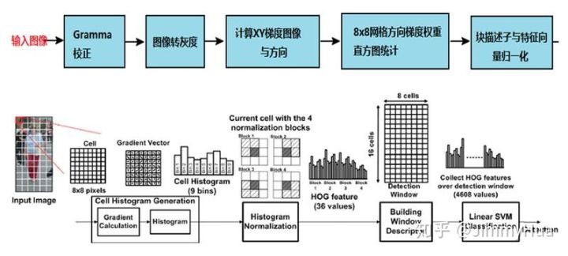

传统的对象检测与标注技术 HOG + SVM
===
> create by [afterloe](605728727@qq.com)  
> version is 1.0.0  
> MIT License

#### HOG特征描述子提取
HOG(Histogram of Oriented Gradient)特征在对象识别与模式匹配中是一种常见的特征提取算法，是基于本地像素块进行特征直方图提取的一种算法，对象局部的变形与光照影响有很好的稳定性。

#### HOG特征描述子提取过程

 
> 如图，HOG特征描述子的提取的整体过程

##### Gamma矫正  
Gamma矫正是为了提高好检测器对光照、机器干扰等噪声影响的因素的识别性，需要对图像进行Gamma矫正，完整的矫正过程为：
图像归一化，调整对比度 。

##### 灰度处理
将图像转化为灰度图像，可有效提升特征的描述信息。

##### 计算图像XY梯度与方向
使用`Sobel`算子计算梯度
```python
gx = cv.Sobel(image, cv.CV_32F, 1, 0, ksize=1)
gy = cv.Sobel(image, cv.CV_32F, 0, 1, ksize=1)
```
使用公式求取梯度的值和方向：
```python
mag, angle = cv.cartToPolar(gx, gy, angleInDegress=True)
```

##### 8*8网格方向梯度与权重直方图统计
默认HOG描述子窗口为`64 * 128`，窗口移动步长为`8 * 8`， 移动窗口为`4 * 4`， 直方图把180度分为9个bin，每个区间为20度，如果像素落在某个区间，
就把该像素的直方图累计到对应区间的直方图上。每个block有4个cell,每个cell有9个向量值，即每个block有36个向量，所以整个窗口有7x15x36=3780个特征描述子。

##### 块描述子和特征向量归一化
每个block可以得到4个9维的向量，需要再次进行一次归一化，这样可以进一步提高泛化能力

Histogram of Oriented Gradients and Object Detection
I’m not going to review the entire detailed process of training an object detector using Histogram of Oriented Gradients (yet), simply because each step can be fairly detailed. But I wanted to take a minute and detail the general algorithm for training an object detector using Histogram of Oriented Gradients. It goes a little something like this:

Step 1:
Sample P positive samples from your training data of the object(s) you want to detect and extract HOG descriptors from these samples.

Step 2:
Sample N negative samples from a negative training set that does not contain any of the objects you want to detect and extract HOG descriptors from these samples as well. In practice N >> P.

Step 3:
Train a Linear Support Vector Machine on your positive and negative samples.

Step 4:
Apply hard-negative mining. For each image and each possible scale of each image in your negative training set, apply the sliding window technique and slide your window across the image. At each window compute your HOG descriptors and apply your classifier. If your classifier (incorrectly) classifies a given window as an object (and it will, there will absolutely be false-positives), record the feature vector associated with the false-positive patch along with the probability of the classification. This approach is called hard-negative mining.

Step 5:
Take the false-positive samples found during the hard-negative mining stage, sort them by their confidence (i.e. probability) and re-train your classifier using these hard-negative samples. (Note: You can iteratively apply steps 4-5, but in practice one stage of hard-negative mining usually [not not always] tends to be enough. The gains in accuracy on subsequent runs of hard-negative mining tend to be minimal.)

Step 6:
Your classifier is now trained and can be applied to your test dataset. Again, just like in Step 4, for each image in your test set, and for each scale of the image, apply the sliding window technique. At each window extract HOG descriptors and apply your classifier. If your classifier detects an object with sufficiently large probability, record the bounding box of the window. After you have finished scanning the image, apply non-maximum suppression to remove redundant and overlapping bounding boxes.

