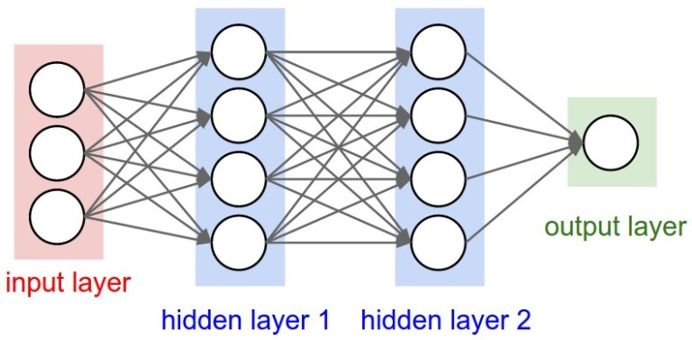
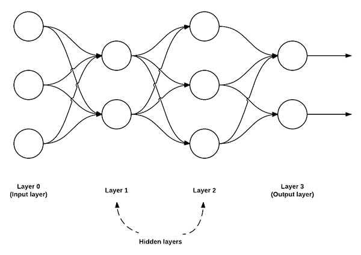

# Python3 前馈网络训练与测试
> create by [afterloe](605728727@qq.com)  
> MIT License  
> version is 1.0.3

Keras是一个功能强大，易于使用的Python库，用于构建神经网络和深度学习网络，本篇博文将进行图像分类训练。

## 数据集
使用到的数据集可以在[这里](https://www.kaggle.com/c/dogs-vs-cats/data)下载，提供了2.5W的分类数据。

## 前馈网络简介
前馈神经网络是最常见的架构是前馈网络，

> 一个具有3个输入节点的输入层，一个具有2个节点的隐藏层，一个具有3个节点的第二个隐藏层以及具有2个节点的最终输出层的前馈神经网络的示例。

在这种类型的体系结构中，两个节点之间的连接仅允许从第一层的节点到第一层+1层的节点（因此称为前馈；不允许向后或层间连接）。此外，
层i中的节点与层i+1中的节点完全连接。这意味着层i中的每个节点都连接到层i+1中的每个节点。
例如，在上图中，第0层和第1层之间总共有2 x 3=6个连接—这就是术语“完全连接”或简称“FC”。

通常使用一个整数序列来快速、简洁地描述每一层中的节点数。例如，上面的网络是一个3-2-3-2前馈神经网络：
* 层0包含3个输入，即x{i}值。这些可能是原始像素强度或来自特征向量的条目。
* 第1层和第2层是隐藏层，分别包含2个和3个节点。
* 第3层是输出层或可见层-这是我们从我们的网络获得整体输出分类的地方。输出层通常有与类标签一样多的节点；每个潜在输出有一个节点。
> 在Kaggle Dogs vs.Cats示例中，有两个输出节点，一个用于“dog”，另一个用于“cat”。

## 项目目录结构
```
    Project
    │  main.py
    │  requirements.txt
    │  README.md
    ├─sample
    │  │  funs.py
    │  │  code.py
    │  │  __init__.py
    ├─out
    │      simple_neural_network.hdf5
    ├─tests
    │      test_model.py
    └─resources
```
- main.py: 主程序入口
- requirements.txt: 依赖包安装
- REAMDE.md: 文档
- sample: 程序逻辑
- out: 训练模型的出口
- tests: 测试用例
- resources: 测试资源包，放置测试图像

## 依赖安装
训练依赖于Tensorflow 和 Keras安装，Tensorflow的安装可以参考之前写的博文进行，最好是开启CUDA支持。
> [Configuring Ubuntu for deep learning with Python](https://pyimagesearch.com/2017/09/25/configuring-ubuntu-for-deep-learning-with-python/)  
> [Setting up Ubuntu 16.04 + CUDA + GPU for deep learning with Python](https://www.pyimagesearch.com/2017/09/27/setting-up-ubuntu-16-04-cuda-gpu-for-deep-learning-with-python/)  
> [Configuring macOS for deep learning with Python](https://www.pyimagesearch.com/2017/09/29/macos-for-deep-learning-with-python-tensorflow-and-keras/)  

## 分类原理
使用颜色的直方图进行特征提取与分类，也可以使用原始像素进行提取与分类。将图像调整为固定的尺寸，以确保输入数据集中的每个图像都具有相同的特征向量。在利用神经网络时，
要求每个图像必须由矢量表示，所有`funs.image_to_feature_vector(image)`方法实现该步骤。  
> 在本示例中，将图像尺寸调整为32 x 32像素，然后将32 x 32 x 3图像（其中图像有三个通道，红色，绿色和蓝色通道）， 所以为3072-d的特征向量。  

```python
data = np.array(data) / 255.0
```

将输入数据缩放到[0，1]范围，然后将标签从一组整数转换为一组向量（对交叉熵损失函数的要求，将在训练神经元时应用于对应网络）。
```python
(trainData, testData, trainLabels, testLabels) = train_test_split(
	data, labels, test_size=0.25, random_state=42)
```
使用75％的数据进行训练，其余25％进行测试。

```python
model = Sequential()
model.add(Dense(768, input_dim=3072, init="uniform",
	activation="relu"))
model.add(Dense(384, activation="relu", kernel_initializer="uniform"))
model.add(Dense(2))
model.add(Activation("softmax"))
```
以上代码演示了`3072-768-384-2`的前馈网络构建，因为输入层有3,072个节点，展开后的输入图像中每个32 x 32 x 3 = 3,072个原始像素。 
然后，有两个隐藏层，每个隐藏层分别具有768和384个节点。这些节点数是通过交叉验证和离线执行的超参数调整实验确定的。 
而输出层有2个节点-每个“dog”和“cat”标签一个。在网络顶部应用softmax激活函数。  
下一步是使用随机梯度下降（SGD）训练模型, 为了更好的训练模型，将SGD的学习率参数设置为**0.01**。对网络使用binary_crossentropy
损失函数，在大多数情况下，只使用 `crossentropy`，但是由于只有两个类标签，因此我们使用`binary_crossentropy`。
对于大于2个类别的标签，请使用`crossentropy`。 然后允许该网络训练总共50个时期，意味着该模型“看到”每个单独的训练示例50次，以尝试学习基础模式。 


## 编译模型
```shell script
'D:\Program Files\Python37-64\python.exe' .\main.py -d G:\Project\opencv-resources\dogs-vs-cats\train\ -m .\out\simple_neural_network.hdf5
```

## 调整参数于训练内容，提升准确性
待更新